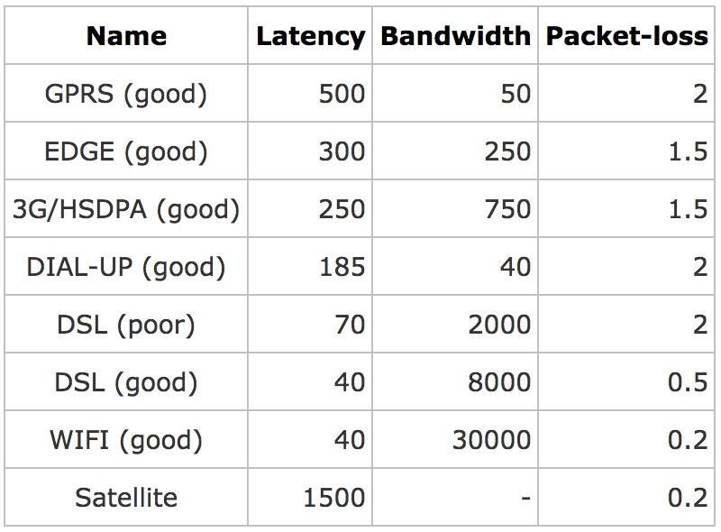

## 環境
1. raspberry pi 3 model B
  - 支援 wifi & ethernet
  - wifi : 當 ap
  - ethernet : 接 router

## 安裝前需準備
1. 檢查機器是否支援 AP 
  - `iw list`, 在 'Supported interface modes' 下, 須找到 AP 的選項
2. 檢查網路 : `ifconfig -a`, 在 pi3 下, 依序會是
  - eth0(wifi interface) : 此張網卡, 會被設定成 AP mode interface
  - lo : The Loopback Network Interface
  - wlan0(ethernet interface) : 此為 ethernet, 有線網路
3. 執行 `route` 指令, 在 default 下可看到, 兩張網卡目前都有在運作
  - 目標就是透過 iptable 的方式，建立 wifi 與 ethernet 的橋接

# Requirements
## virtual environment : (optional)
- install : `pip install virtualenv`
- configure :
  - `mkdir -p ~/dev/atc`
  - `virtualenv ~/dev/atc/venv`
  - `source ~/dev/atc/venv/bin/activate`

## ATC Daemon
- install : `pip install atcd atc_thrift`
- Run for test : `atcd --atcd-lan {wifi} --atcd-wan {ethernet}`
  - ex : `atcd --atcd-lan wlan0 --atcd-wan eth0`
  - use ifconfig to check lan & wan
  - 必須將 wifi 設定為 ap mode, 不然會有錯誤

## ATC UI Interface
- `pip install django-atc-api django-atc-demo-ui django-atc-profile-storage`
- download github repo : `git clone https://github.com/jhaoheng/facebook_atc.git`
- init : `cd facebook_atc/webapp && python manage.py migrate`

# raspberry wifi 設定 
## 設定為 ap mode
## 設定回預設狀態

# Run facebook-atc step
1. 確認是在 virtual environment 下 : `source ~/dev/atc/venv/bin/activate`
2. 確認 wifi 在 ap mode 狀態下 : 參考 'ap-mode-config' 資料夾
3. 執行 atcd daemon : `atcd --atcd-lan 對內 --atcd-wan 對外`
4. 執行 website app : `cd facebook_atc/webapp && python manage.py runserver 0.0.0.0:8000`

# 使用

1. 開啟瀏覽器並打開 atc_demo_ui 的管理介面
2. 主要設置的參數有：
  - 網絡帶寬（bandwidth）
  - 延遲（latency）
  - 丟包率（packet loss）
  - 錯包率（corrupted packets）
  - 亂序率（packets ordering）
3. 新增 new profile 與 shaping settings 後，可在 Profiles 中看到設定的參數值，選擇後再開啟最上方的 trun on 即可
  - Network Condition Profiles 參考 : https://github.com/tylertreat/Comcast#network-condition-profiles

> 設定參考
